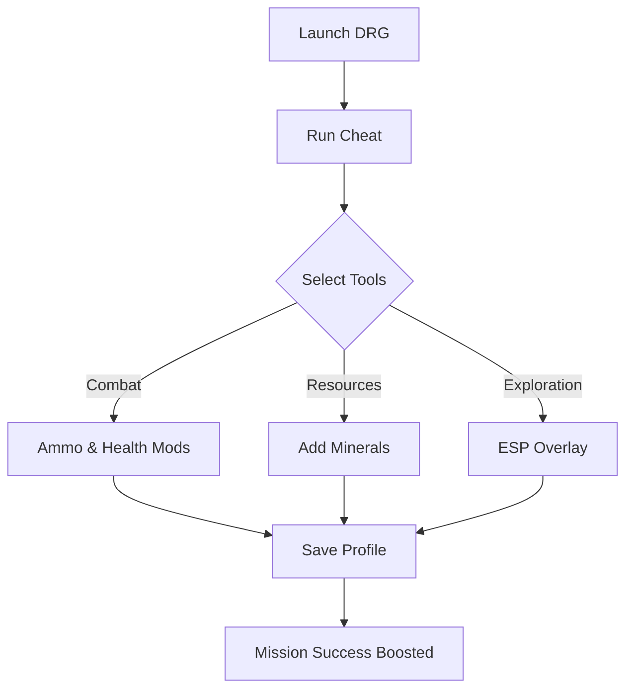

# Deep Rock Galactic Cheat Software for Mining & Combat Boosts

In the caves of Hoxxes, every mission is a gamble. The **Deep Rock Galactic Cheat** gives you more control over those risks—speeding up resource farming, empowering your dwarf, and ensuring mission success. With combat enhancements, ESP overlays, and resource tools, you’ll mine faster and fight harder without the grind.

---

## 🧰 Features

* **Combat Enhancements ⚔️**

  * Infinite ammo & grenades.
  * No recoil or spread for precision shooting.
  * Freeze health or activate god mode.

* **Resource Tools ⛏️**

  * Instantly add gold, nitra, and rare crafting minerals.
  * Unlimited carrying capacity.

* **Awareness & ESP 👁**

  * Glow outlines for enemies, loot, and mission objectives.
  * Radar overlay to reveal cave layouts.

* **Utility Shortcuts**

  * Speed boost toggle for traversal.
  * Instant revive and team buff hotkeys.

* **Profile System**

  * Save configs for farming runs, combat-heavy missions, or co-op support play.

[](#)
[](#)
[](#)
[](#)

---

## 🖥 Compatibility

| Platform       | Status         | Notes                              |
| -------------- | -------------- | ---------------------------------- |
| Windows 10/11  | ✅ Full Support | DX11/12 supported.                 |
| Steam          | ✅ Compatible   | Injection stable on current patch. |
| Xbox Game Pass | ⚠️ Partial     | Limited due to UWP restrictions.   |
| Epic Games     | ⚠️ Partial     | Manual injection recommended.      |

\[!WARNING]
The cheat is designed for **solo or private lobbies**. Using it in public matchmaking may risk bans or desync issues.

---

## ⚡ Setup

1. **Download** the cheat package.
2. Extract into your Deep Rock Galactic directory.
3. Launch the game, then run the cheat as Administrator.
4. Configure hotkeys. Example:

```ini
[F1] = Infinite Ammo  
[F2] = Add 500 Nitra  
[F3] = Toggle ESP Overlay  
[F4] = God Mode  
[F5] = Speed Boost  
```

5. Save your preferred profile.

---

## 📊 Workflow Diagram



---

## ❓ FAQ

**Q: Can this cheat spawn crafting resources?**
A: Yes—spawn nitra, gold, jadiz, and other rare minerals directly.

**Q: Does god mode work for the whole squad?**
A: No, it only applies to your dwarf. Allies must run their own trainer for shared buffs.

**Q: Is performance affected by ESP overlays?**
A: Overlays are optimized; minimal FPS drop even in large caves.

**Q: Can I use this online?**
A: Recommended for private lobbies only. Public multiplayer carries detection risk.

**Q: Are updates frequent?**
A: The cheat is updated after every Deep Rock Galactic patch to maintain compatibility.

---

## 🚀 Final Thoughts

The **Deep Rock Galactic Cheat** lets you mine smarter, fight harder, and progress faster. With customizable tools for combat, farming, and awareness, it transforms every mission into a guaranteed success. Perfect for solo players and private squads who want full control.

[](#)
[](#)
[](#)
[](#)

---
